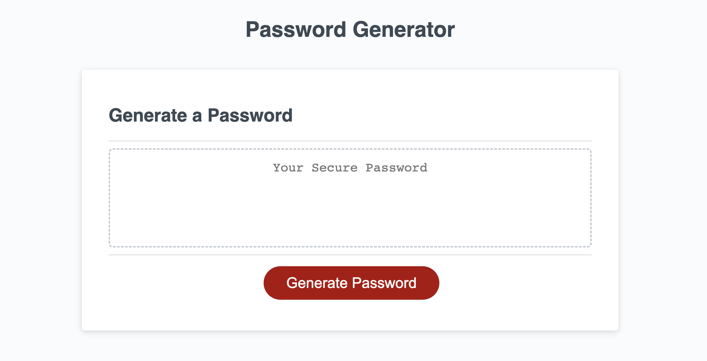

# Password Generator Project

## **Description**

### The purpose of this assignment was to create a password generator that could only use between 8 and 128 character with different symbols, numbers, and letter (Uppercase and lowercase).

 
Link to deployable GitHub page  &nbsp; • &nbsp; (https://connbstro.github.io/Password-generator/)

 

# Built with

HTML, CSS, and JavaScript

## **Overview**

- Created multiple variables within a function.
- Created pop up windows that gave users the options of what kind of characters they wished to use.
- Made pop up window that would give prompt if password was not within the desired length.
- Created "for" loops and "do...while" statements to loop statement until the condition was met.
- Set password criteria and prompt responses.

